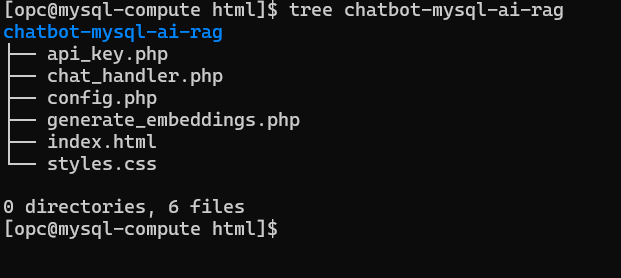
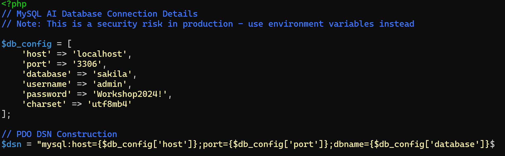
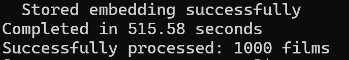

# FilmRAG: A LAMP-Based RAG Implementation Using MySQL AI

## Introduction

This implementation showcases a pure RAG (Retrieval-Augmented Generation) application built entirely on the LAMP stack, powered by MySQL Enterprise Edition 9.4.1's native AI capabilities. Unlike traditional RAG implementations, it does not depend on external AI services or APIs. The application leverages MySQL's built-in AI functions for vector embeddings and text generation. It delivers intelligent movie recommendations from the Sakila sample database through semantic vector search and context-aware LLM responses, all processed within the database layer.

**Note:** The application code in this lab is intended for educational purposes only. It is designed to help developers learn and practice application development skills with MySQL AI. The code is not designed to be used in a production environment.

_Estimated Lab Time:_ 30 minutes

### Objectives

In this lab, you will be guided through the following tasks:

- Understand the Application Architecture
- Review the application source files
- Deploy and configure the application
- How to Check for Errors
- Ho to Run and Test the RAG Application


### Prerequisites

- An Oracle Trial or Paid Cloud Account
- Apache Web server with PHP 8.2+
- MySQL Enterprise Edition 9.4.1 or higher with MySQL AI enabled
- MySQL AI models configured:
  - `all_minilm_l12_v2` for embeddings
  - `llama3.2-3b-instruct-v1` for text generation
- Some experience with MySQL SQL and PHP
- Completed Lab 6

## Task 1: Understand the Application

### Directory Structure

```markdown
chatbot-mysql-ai-rag/
├── api_key.php              # MySQL database connection configuration
├── chat_handler.php         # Main chat processing with Pure RAG logic
├── index.html               # Frontend UI with Pure RAG indicators
└── styles.css               # Enhanced CSS with Pure RAG styling
```

### Technical Components
Core Components:

Frontend (index.html + styles.css) - Terminal-style chat interface with markdown rendering
Backend (chat_handler.php) - Request routing and conversation management
Database (api_key.php) - MySQL connection to Sakila database with AI capabilities
RAG Pipeline - Semantic search → Context building → LLM response generation

Key Features:
- Semantic movie search using vector embeddings (all_minilm_l12_v2 model)
- Pure RAG mode for movie queries, regular chat for general questions
- Session-based conversation history (up to 12 messages)
- Markdown formatting with syntax highlighting (Prism.js)
- Responsive terminal-inspired UI with copy-to-clipboard functionality


### The RAG Pipeline Flow

From a developer perspective, here's the request flow:

1. User submits a query via the web interface
2. `chat_handler.php` receives the query and routes it based on content analysis
3. For movie queries, `getPureRAGResponse()` extracts the search terms and initiates semantic retrieval
4. `semanticMovieRetrieval()` generates a vector embedding using MySQL's `sys.ML_EMBED_ROW()` with the all_minilm_l12_v2 model
5. The system performs similarity search using MySQL's `DISTANCE()` function against the film_rag table embeddings
6. Retrieved film information (top 8 matches) is formatted into context with relevance scores
7. `buildPureRAGPrompt()` constructs an enhanced prompt combining movie context and conversation history
8. The prompt is sent to MySQL's `sys.ML_GENERATE()` using the llama3.2-3b-instruct-v1 model
9. The AI-generated response is returned to the frontend and displayed to the user


## Task 1: Deploy and configure the application

# 1. Clone/upload files to web server directory

wget https://objectstorage.us-ashburn-1.oraclecloud.com/p/zadOmciLI8d7flsZL2lnsDaibDYxQ8bCS5dXnFrSQWpf38-CUE1GwAG2gUkHB5sk/n/idazzjlcjqzj/b/mysql-ai-store/o/chatbot-mysql-ai-rag.zip

/var/www/html/rag-chatbot/
├── api_key.php
├── chat_handler.php
├── index.html
└── styles.css

# 2. Set permissions
chmod 644 *.php *.html *.css
chmod 755 /var/www/html/rag-chatbot/

# 3. Configure database credentials in api_key.php
$db_config = [
    'host' => 'localhost',
    'database' => 'sakila',
    'username' => 'your_user',
    'password' => 'your_password'
];

# 4. Enable PHP session support
# Ensure session.save_path is writable in php.ini


### Key PHP Implementation Details

The application primarily implements vector similarity using PHP functions:

1. **API-Based Embeddings and PHP-Based Similarity**: The `vector_functions.php` file contains functions for generating embeddings via the OpenAI API and calculating cosine similarity in PHP. The application retrieves vector embeddings from MySQL and performs similarity calculations in PHP code rather than using database-native vector operations.

The current implementation in `rag_api.php` is configured to always use vector search.

The application uses cURL for API calls with proper error handling and logging:

```markdown
// Example of error handling in the cURL implementation
if (curl_errno($ch)) {
    error_log("[RAG] cURL error: " . curl_error($ch));
    curl_close($ch);
    return false;
}
```

## Task 3: Deploy and configure MySQL Chatbot / RAG Application  

1. Go to the development folder

    ```bash
    <copy>cd /var/www/html</copy>
    ```

2. Download application code

    ```bash
    <copy> sudo wget https://objectstorage.us-ashburn-1.oraclecloud.com/p/zadOmciLI8d7flsZL2lnsDaibDYxQ8bCS5dXnFrSQWpf38-CUE1GwAG2gUkHB5sk/n/idazzjlcjqzj/b/mysql-ai-store/o/chatbot-mysql-ai-rag.zip</copy>
    ```

3. unzip Application code

    ```bash
    <copy>sudo unzip chatbot-mysql-ai-rag.zip</copy>
    ```

4. View files in application folder structure


    ```bash
    <copy>tree chatbot-mysql-ai-rag</copy>
    ```
    

    
5. Update the api_key.php files:
    - 'host' => **'localhost'**,
    - 'user' => **'admin'**,
    - 'password' => **'Workshop2024!'**,
    - 'database' => **'sakila'*

    ```bash
    <copy>sudo nano chatbot-mysql-ai-rag/api_key.php</copy>
    ```

    


## Task 4: How to Check for Errors

When running the FilmRAG application, you might need to check the PHP error logs to diagnose any issues. Here are some useful commands for error checking:

1. View the most recent PHP errors in real-time:

      ```bash
      <copy>sudo tail -f /var/log/php-fpm/www-error.log</copy>
      ```
   This command will display new error messages as they occur, which is useful for debugging while actively using the application.

2. Clear the error log if it becomes too large or cluttered:

      ```bash
      <copy>sudo truncate -s 0 /var/log/php-fpm/www-error.log</copy>
      ```
   This command will empty the error log file without deleting it, giving you a clean slate for new error messages.

3. These commands are particularly helpful when:

   - The application isn't responding as expected
   - You're seeing blank pages or incomplete responses
   - The RAG functionality isn't retrieving film information correctly
   - There are issues with the OpenAI API connections

The application is designed to log detailed error information, which can help identify issues with database connections, API calls, or vector operations.

## Task 5: Run and test MySQL Chatbot / RAG Application 

1. Run Script to generate film embeddings  
   Go to the Application folder

    ```bash
    <copy>cd /var/www/html</copy>
    ```

    ```bash
    <copy>cd my-web-app/rag_service</copy>
    ```

    ```bash
    <copy>php generate_embeddings.php</copy>
    ```

    This script will generate vector embeddings for each of the films in the Sakila database using the OpenAI API. 
    
    - The script execution may take about 10 minutes as it processes up to 1,000 films. 
    - The execution will sometime slow down to breathe... don't panic it will complete the job.

      

2. Run the application by navigating to:

    <http://your-server-ip/my-web-app/chatbot/>

    

3. Test the application by clicking the "Sample Prompts" menu. Select a prompt and hit _Send_

   The sample prompts are organized into different categories:
   - Basic Queries
   - Genre-Specific Queries
   - Semantic Search Queries
   - Thematic Queries
   - Complex Queries

4. **Try your own testing and have a little fun**

   Here are some example queries to try:
      - What movie is about a battle between a cow and a waitress?
      - Tell me about the movie ALIEN CENTER?
      - Click "New Chat" to start a fresh conversation
      - Tell me about the movie CHICAGO NOOOORTH? (Intentional typo)
      - Tell me about the movie CHICAGO NORTH? (Correct title)
      - Click "New Chat" again
      - Do you know when the movie Chicago N. was released?
      - I’d like to watch a movei with a compooser and a detective in it. Oh, and I’d like it to be super fun. What movie do you think I’ll enjoy?

5. Observe how the system handles:
   - Direct film title matches
   - Semantic similarities
   - Spelling variations
   - Incomplete title information
   - Natural language questions about films

This hands-on experience demonstrates the power of combining MySQL's vector capabilities with an LLM for creating a domain-specific chatbot with improved accuracy and relevance.

## Learn More

- [MySQL Vector Functions](https://dev.mysql.com/doc/refman/9.2/en/vector-functions.html)
- [MySQL Vector Datatype: create your operations](https://blogs.oracle.com/mysql/post/mysql-vector-datatype-create-your-operations-part-1)

## Acknowledgements

- Authors: Craig Shallahamer, Applied AI Scientist, Viscosity North America, Perside Foster, Open Source Principal Partner Solution Engineer
- Contributors: Open Source Channel Enablement Team (Nick Mader, Chris Bates, Juliana Castro)
- Last Updated: Perside Foster, October 2025
