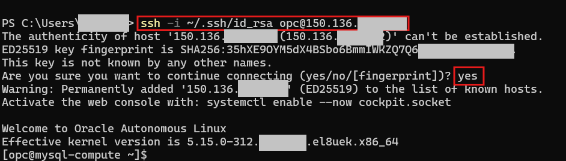
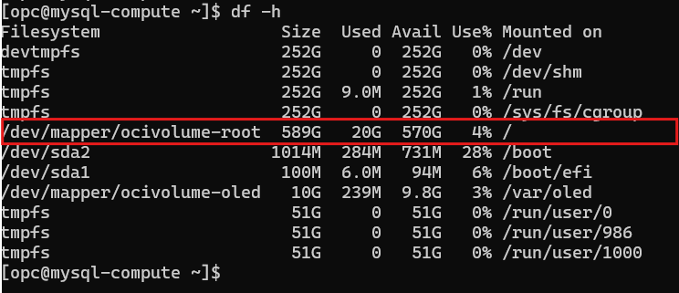

# Install MySQL Enterprise Edition

## Introduction

MySQL AI provides developers the ability to build rich applications with MySQL leveraging built in machine learning, GenAI, LLMs and semantic search. They can create vectors from documents stored in a local file system. Customers can deploy these AI applications on premise or migrate them to MySQL HeatWave for lower cost, higher performance, richer functionality and latest LLMs with no change to their application. This gives developers the flexibility to build their applications on MySQL EE and then deploy them either on premise or in the cloud. 

_Estimated Time:_ 20 minutes

### Objectives

In this lab, you will be guided through the following tasks:

- Install MySQL AI
- Start and test MySQL AI


### Prerequisites

This lab assumes you have:

- Completed Labs 2

ssh -i ~/.ssh/your-key opc@<instance-public-ip>

## Task 1: Connect to OCI compute  and verify storage availability 

1. Connect with SSH, on Command Line, connect to the Compute instance using SSH ... be sure replace the  "private key file"  and the "new compute instance Public IP". Enter  **Yes** for the "Are you sure" question.

     ```bash
    <copy>ssh -i private_key_file opc@new_compute_instance_public_ip</copy>
     ```

    


1. Verify OCI compute instance 600GB storage is available for use

    ```bash
    <copy>df -h</copy>
    ```

    > **Important:** Your df -h output should show your 600GB storage is already available and mounted!

    

    The following output entry means: You're all set! You have 570GB of free space available right now

    **/dev/mapper/ocivolume-root  589G   20G  570G   4% /**
    - Total size: 589GB (close to your 600GB - some space is reserved for filesystem overhead)
    - Used: 20GB
    - Available: 570GB free
    - Mounted at: / (root directory)

## Task 2: Install MySQL AI.

1. Create installation folder

    ```bash
    mkdir ~/mysql-ai-workshop
    ```
2. Go to new directory 

    ```bash
    cd ~/mysql-ai-workshop
    ```
3. Download MySQL AI file
    ```bash    
    wget https://objectstorage.us-ashburn-1.oraclecloud.com/p/ywKKB1ymwLAeMUa3yiA4KE1l1EUu-xz4pXJC_XCPrxzUe3HKcKkTIYrUWk5gPk1C/n/idazzjlcjqzj/b/mysql-ai-store/o/V1051679-01.zip
    ```
4. Unzip the downloaded file

    ```bash
    unzip V1051679-01.zip
    ```

5. Make sure the required files are available.

    ```bash
    ls -la
    find . -name "*.rpm"
    ```

#### Task 3: Install MySQL AI (15 minutes)

1. Installs the MySQL AI setup tool/installer onto your system

    ```bash
    sudo dnf localinstall mysql-ai-setup-9.4.1-1.el8.x86_64.rpm -y
    ```
2. Install  and configure MySQL Server 9.4.1 with AI/ML capabilities (HeatWave GenAI), download the embedded LLM models (llama3.2, e5-small, etc.), set up the ML functions and procedures, and starts the MySQL service. 
    ```bash
    sudo mysql-ai-setup --cli \
        --mysql-root-user=admin \
        --mysql-root-password='Workshop2024!' \
        --mysql-root-allow-remote-connection \
        --secure-file-priv=/var/lib/mysql-files \
        --skip-ai-encryption
    ```
3. Wait for installation to complete (5-10 minutes)


1. Create a new directory named "tmp"

    ```bash
    <copy>mkdir tmp</copy>
    ```

3. Navigate into the "tmp" directory

     ```bash
    <copy>cd tmp</copy>
    ```

4. Get  OTN MySQL Enterprise Edition package

    ```bash
    <copy>wget 'https://objectstorage.us-ashburn-1.oraclecloud.com/p/_85tMv-_I0WRJRAuHI9StGHfo3WXtAsSbpslsOIqIu2hsHgmKc8n7zmhk-5KvVw8/n/idazzjlcjqzj/b/mysql-ee-downloads/o/Oracle%20Technical%20Resource(OTR)/mysql-enterprise-9.2.0_el8_x86_64_bundle.tar'</copy>
    ```

5. Extract the contents of the `mysql-enterprise-9.2.0_el8_x86_64_bundle.tar` archive file

    ```bash
    <copy>tar xvf mysql-enterprise-9.2.0_el8_x86_64_bundle.tar</copy>
    ```

## Task 2: Install MySQL Enterprise Edition

1. Import the MySQL repository GPG key using the RPM package manager

    ```bash
    <copy>sudo rpm --import https://objectstorage.us-ashburn-1.oraclecloud.com/p/Yja90YIvw39JvHu0YusNxl_wdKS-1hPt0_a_39eT_ihp-xm8kYR3CA3eKe5ny99C/n/idazzjlcjqzj/b/mysql-ee-downloads/o/RPM-GPG-KEY-mysql-2023</copy>
    ```

2. Install the "yum-utils" package using the Yum package manager

    ```bash
    <copy>sudo yum install yum-utils</copy>
    ```

3. Add a new Yum repository configuration file located at "/home/opc/tmp"

    ```bash
    <copy>sudo yum-config-manager --add file:///home/opc/tmp</copy>
    ```
 
4. Disable the "mysql" module using the Yum package manager

    ```bash
    <copy>sudo yum module disable mysql -y </copy>
    ```

5. Install the "mysql-commercial-server" package

    ```bash
    <copy>sudo yum install mysql-commercial-server -y </copy>
    ```

6. Install the "mysql-shell-commercial" package

    ```bash
    <copy>sudo yum install mysql-shell-commercial -y </copy>
    ```

## Task 3: Configure and Start MySQL Enterprise Edition

1. Start the MySQL server using the systemd system and service manager

    ```bash
    <copy>sudo systemctl start mysqld</copy>
    ```

2. Check the status of the MySQL server service

    ```bash
    <copy>sudo systemctl status mysqld</copy>
    ```

3. List all running processes and filter for those containing "mysqld" in their command line

    ```bash
    <copy>ps -ef | grep mysqld</copy>
    ```

## Task 4: Change root password and create admin account

1. Search for the phrase "temporary password" in the "/var/log/mysqld.log" file, ignoring case sensitivity

    ```bash
    <copy>sudo grep -i 'temporary password' /var/log/mysqld.log</copy>
    ```

2. Login to MySQL using password retrieved in previous step

    ```bash
    <copy>mysqlsh -uroot -hlocalhost -p</copy>
    ```

3. Change root password

    ```bash
    <copy>ALTER USER 'root'@'localhost' IDENTIFIED BY 'Welcome#123';</copy>
    ```

4. Show MySQL server  status

    ```bash
    <copy>\status</copy>
    ```

5. The root account **can connect only locally**, so we create now the 'admin'@'%' account that **can connect locally and remotely**

    ```bash
    <copy>CREATE USER 'admin'@'%' IDENTIFIED BY 'Welcome#123';</copy>
    ```

    ```bash
    <copy> GRANT ALL ON *.* TO admin@'%' WITH GRANT OPTION;</copy>
    ```

    ```bash
    <copy>\q</copy>
    ```

You may now **proceed to the next lab**.

## Learn More

- [MySQL Enterprise Edition](https://www.oracle.com/mysql/enterprise/)
- [MySQL Linux Installation](https://dev.mysql.com/doc/en/binary-installation.html)
- [MySQL Shell Installation](https://dev.mysql.com/doc/mysql-shell/en/mysql-shell-install.html)

## Acknowledgements

- **Author** - Craig Shallahamer, Applied AI Scientist, Viscosity North America
- **Contributor** - Perside Foster, MySQL Solution Engineering 
- **Last Updated By/Date** - Perside Foster, MySQL Solution Engineering , July 2025
