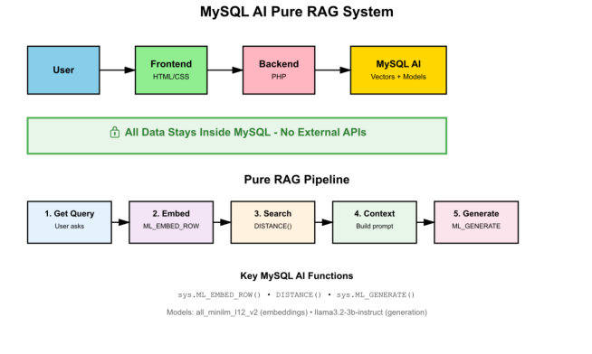

# Introduction

## About this Workshop

### Building Intelligent Applications with MySQL Enterprise Edition for MySQL AI Vector Search

In this workshop, we'll explore the powerful combination of MySQL Enterprise Edition for MySQL AI's built-in language models, vector search, and relational databases to create a truly intelligent film recommendation application. We'll be working with MySQL Enterprise Edition 9.4.1, showing how this traditional relational system can be transformed into an AI-powered recommendation engine that understands not just what films people like, but why they like them - **all while keeping your data completely private and secure within your database**.

### What is MySQL Enterprise Edition for MySQL AI?

MySQL Enterprise Edition for MySQL AI represents a revolutionary approach to integrating artificial intelligence directly into the database layer. Announced in April 2025, MySQL Enterprise Edition for MySQL AI brings machine learning capabilities natively into MySQL Enterprise Edition, allowing you to:

- **Generate vector embeddings** directly in SQL using `sys.ML_EMBED_ROW()`
- **Perform semantic searches** with the new VECTOR data type and DISTANCE functions
- **Generate natural language responses** using `sys.ML_GENERATE()` with built-in LLMs
- **Keep your data private** - no data is sent to third-party AI services
- **Eliminate external API costs** - all AI processing happens within MySQL
- **Maintain complete control** over your data and AI operations

Unlike traditional RAG implementations that rely on external AI services like OpenAI, **MySQL Enterprise Edition for MySQL AI keeps all your data within your organization's infrastructure**, ensuring compliance with data privacy regulations and eliminating concerns about data sharing with third parties.

### What You will Learn

During this workshop, you'll build a complete Pure RAG application that can answer detailed questions about movies by combining the Sakila film database with MySQL Enterprise Edition for MySQL AI's native capabilities. We'll start by building a standalone chatbot interface with a terminal-themed design, then integrate it with MySQL's vector capabilities and built-in AI models. You'll get hands-on experience setting up Pure RAG with MySQL's vector functions, semantic search, and the integrated llama3.2-3b-instruct model for response generation.

**Key Skills You'll Develop:**
- Creating and managing VECTOR data types in MySQL
- Generating embeddings using MySQL Enterprise Edition for MySQL AI's built-in models
- Performing semantic similarity searches with DISTANCE functions
- Building RAG pipelines entirely within the database
- Generating natural language responses without external APIs
- Managing conversation context and history
- Deploying self-contained AI applications

### Why This Matters

Traditional AI implementations face several critical challenges that MySQL Enterprise Edition for MySQL AI solves:

**Data Privacy & Security:**
- ❌ Traditional: Data sent to third-party AI services
- ✅ MySQL AI: All data stays within your database
- ✅ Meet GDPR, HIPAA, SOC2 requirements

**Cost & Performance:**
- ❌ Traditional: Unpredictable per-token API costs
- ✅ MySQL AI: One-time licensing, no per-query fees
- ✅ Lower latency, no rate limits

**Control & Reliability:**
- ❌ Traditional: Dependent on external services
- ✅ MySQL AI: Full control over your AI infrastructure
- ✅ No external dependencies

Our Pure RAG implementation provides:
- **Native AI Integration**: Built-in models for embeddings and generation
- **Zero External Dependencies**: No OpenAI or external API calls
- **Complete Data Privacy**: Data never leaves your MySQL instance
- **Accurate Responses**: Retrieves relevant facts before generating
- **Lower Total Cost**: No per-token charges
- **Semantic Understanding**: Vector-based similarity search

### Our Approach

We'll break this workshop into manageable phases:

1. **Foundation**: Build a standalone chatbot with a terminal-themed interface
2. **Database Setup**: Install MySQL Enterprise Edition 9.4.1 and configure MySQL Enterprise Edition for MySQL AI capabilities
3. **Vector Preparation**: Set up the Sakila sample database with vector embeddings using `sys.ML_EMBED_ROW()`
4. **Pure RAG Deployment**: Deploy the complete application that uses MySQL's semantic search and AI generation functions
5. **Testing & Validation**: Test the system with various movie queries to see Pure RAG in action

### System Architecture Diagram

The architecture diagram illustrates the Pure RAG system structure and data flow, highlighting the **self-contained nature** of the implementation:

**Main Components:**
1. **Frontend**: HTML/CSS/jQuery with AJAX for responsive user interface
2. **Backend**: PHP/Apache handling requests and orchestrating the RAG pipeline
3. **MySQL Database**: Vector columns in Sakila database with embedded film descriptions
4. **MySQL Enterprise Edition for MySQL AI**: Built-in models running entirely within the database
   - `all_minilm_l12_v2`: Generates 384-dimensional embeddings for semantic search
   - `llama3.2-3b-instruct`: Generates natural language responses

**🔒 Data Privacy Notice**: All components run within your infrastructure. **No data is transmitted to external AI services** - embeddings, vector searches, and response generation all happen within MySQL.

### Real-World Applications

The techniques you'll learn in this workshop are directly applicable to numerous business scenarios where **data privacy is paramount**:

**Enterprise Use Cases:**
- **Internal Knowledge Bases**: Search company documentation without exposing data to third parties
- **Customer Support**: Provide AI-powered support while maintaining customer data privacy
- **Healthcare**: Build HIPAA-compliant medical record search systems
- **Financial Services**: Create compliant financial advisory systems
- **Legal**: Search case law and contracts while maintaining attorney-client privilege
- **Human Resources**: AI-powered HR assistants that keep employee data private
- **Product Recommendations**: Personalized suggestions without sharing customer behavior data

**Key Advantages for Business:**
- Meet regulatory compliance requirements (GDPR, HIPAA, SOC2, PCI-DSS)
- Eliminate vendor lock-in and dependency on external AI services
- Control costs with predictable licensing vs. unpredictable API charges
- Maintain competitive advantage by keeping proprietary data in-house
- Achieve better performance with reduced latency
- Scale without external rate limits or quotas

After completing this workshop, you'll have a working Pure RAG application and the knowledge to apply these techniques to your own data and use cases - **all while ensuring your data never leaves your infrastructure**. You'll understand how to build sophisticated AI applications that rival external AI services while maintaining complete control and privacy.

Let's get started on our journey to building smarter, more context-aware AI applications with MySQL Enterprise Edition for MySQL AI!

_Estimated Workshop Time:_ 120 minutes

## About Product/Technology

**MySQL Enterprise Edition 9.4.1 for MySQL AI** represents a paradigm shift in database-integrated artificial intelligence:

### Core Database Features:
- **High Performance**: Optimized for demanding workloads with advanced query optimization
- **Vector Data Type**: Native VECTOR data type for efficient storage and operations
- **Advanced Security**: Enterprise-grade encryption, authentication, and audit capabilities
- **High Availability**: Built-in replication and clustering for production resilience
- **Simplified Administration**: Comprehensive tools for database and AI model management
- **24/7 Support**: Professional support services from Oracle's MySQL team
- **Cross-Platform**: Runs on Linux, Windows, and cloud environments

### MySQL Enterprise Edition for MySQL AI Capabilities:

**🔒 Privacy-First AI Integration:**
- **No External Data Transmission**: All AI operations happen within the database
- **No Third-Party Dependencies**: Built-in models eliminate external API requirements
- **Complete Data Control**: Your data never leaves your infrastructure
- **Compliance Ready**: Meet GDPR, HIPAA, SOC2, and other regulatory requirements

**Built-in AI Functions:**
- `sys.ML_EMBED_ROW()`: Generate text embeddings using integrated models
  - Supports multiple embedding models (all_minilm_l12_v2, sentence-transformers)
  - Returns 384-dimensional vectors for semantic search
  - Pre-compute embeddings once for efficiency
- `sys.ML_GENERATE()`: Generate natural language responses using LLMs
  - Includes llama3.2-3b-instruct and other open-source models
  - Full prompt control and customization
- `DISTANCE()`: Calculate vector similarity (cosine, euclidean, dot product)
- Vector operations: Addition, subtraction, normalization, dimensionality

**Model Management:**
- Load pre-trained models from HuggingFace
- Deploy custom fine-tuned models
- Version control for models
- Performance monitoring and optimization

**Cost & Performance Benefits:**
- ✅ **No Per-Token Costs**: Unlimited queries with your MySQL license
- ✅ **Predictable Budgeting**: One-time licensing, no usage-based fees
- ✅ **Lower Latency**: Eliminate external API round-trips
- ✅ **Better Throughput**: Process more queries without rate limits
- ✅ **Offline Capability**: Works without internet connectivity

### Industry Applications:

MySQL Enterprise Edition for MySQL AI is widely used across multiple industries where **data privacy and control are critical**:

- **Healthcare**: HIPAA-compliant patient record search and clinical decision support
- **Financial Services**: SOC2-compliant customer service and fraud detection
- **Government**: Secure document search and citizen service applications
- **Legal**: Privileged document review and case law research
- **E-commerce**: Privacy-respecting product recommendations
- **Manufacturing**: Secure equipment manuals and maintenance documentation
- **Education**: Student data privacy-compliant learning assistants

### Licensing & Access:

You can access MySQL Enterprise Edition for **free** during learning, development, and prototyping by downloading it from Oracle's Technology Network at: https://www.oracle.com/mysql/technologies/mysql-enterprise-edition-downloads.html

For production use, a commercial license must be purchased through MySQL's website: https://www.mysql.com/buy-mysql/

**MySQL Enterprise Edition for MySQL AI capabilities are included with MySQL Enterprise Edition** - no additional licensing required for the AI features.

## Objectives

In this lab, you will be guided through the following steps:

- **Lab 1**: Create a Virtual Cloud Network
- **Lab 2**: Create a Compute instance
- **Lab 3**: Build and Test Apache / PHP Installation
- **Lab 4**: Build Pure RAG Chatbot Application Interface
- **Lab 5**: Install MySQL Enterprise Edition 9.4.1 for MySQL AI
- **Lab 6**: Setup Sakila Sample Database and Configure Vector Embeddings
- **Lab 7**: Build and Deploy MySQL Enterprise Edition for MySQL AI Pure RAG Application
- **Lab 8**: Test and Validate Data Privacy Features

## Prerequisites

- An Oracle Free Tier or Paid Cloud Account
- Basic understanding of SQL and database concepts
- Familiarity with PHP and web development
- Understanding of vector embeddings and semantic search (helpful but not required)
- **No external API accounts required** - MySQL Enterprise Edition for MySQL AI handles everything internally
- **No third-party AI service accounts needed** - fully self-contained

## Key Learning Outcomes

By the end of this workshop, you will:

1. ✅ Understand how MySQL Enterprise Edition for MySQL AI keeps data private and secure
2. ✅ Create and manage VECTOR data types in MySQL
3. ✅ Generate embeddings using `sys.ML_EMBED_ROW()` efficiently (pre-compute once, query many times)
4. ✅ Perform semantic searches with `DISTANCE()` functions
5. ✅ Build complete RAG pipelines within the database
6. ✅ Generate responses using `sys.ML_GENERATE()`
7. ✅ Deploy production-ready AI applications without external dependencies
8. ✅ Apply these techniques to your own use cases while maintaining data privacy

You may now **proceed to the next lab**

## Learn More

- [MySQL Enterprise Edition](https://www.oracle.com/mysql/enterprise/)
- [MySQL AI Announcement Blog](https://blogs.oracle.com/mysql/post/announcing-mysql-ai)
- [MySQL AI Documentation](https://dev.mysql.com/doc/refman/9.4/en/vector-functions.html)
- [MySQL Vector Data Type](https://dev.mysql.com/doc/refman/9.4/en/vector-data-type.html)
- [MySQL AI Functions Reference](https://dev.mysql.com/doc/refman/9.4/en/ai-functions.html)

## Acknowledgements

- **Author** - Craig Shallahamer, Applied AI Scientist, Viscosity North America
- **Contributor** - Perside Foster, Open Source Principal Partner Solution Engineer
- **Last Updated By/Date** - Perside Foster, October 2025