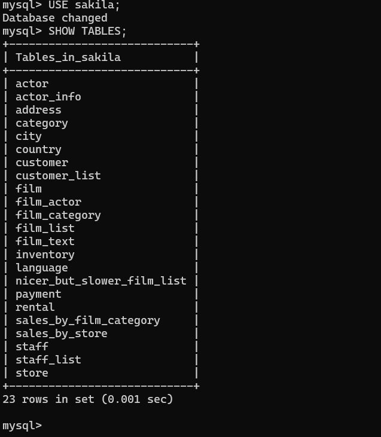
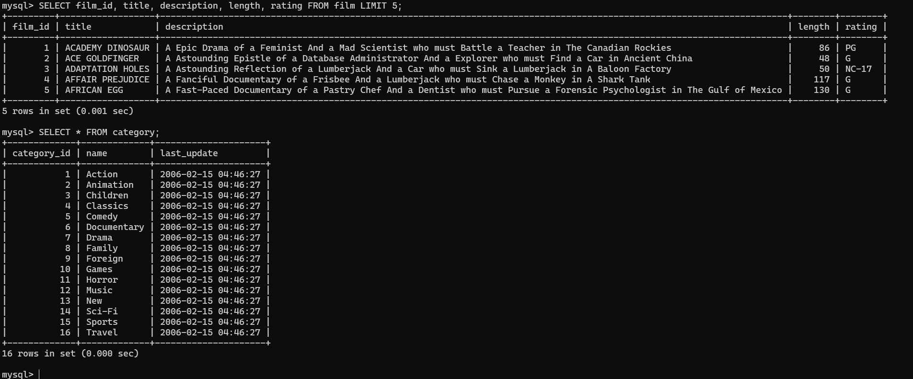

# Setup Sakila Sample Database and JavaScript Stored Function

## Introduction

The Sakila sample database was initially developed by Mike Hillyer, a former member of the MySQL AB documentation team. It is intended to provide a standard schema that can be used for examples in books, tutorials, articles, samples, and so forth. The Sakila sample database also serves to highlight features of MySQL such as Views, Stored Procedures, and Triggers.


_Estimated Time:_ 20 minutes

### Objectives

In this lab, you will be guided through the following tasks:

- Install  and explore Sakila
- Prepare Sakila for  RAG processing

### Prerequisites

This lab assumes you have:

- Completed Labs 5


## Task 1: Build and Review  Sakila database

1. If not already connected with SSH, on Command Line, connect to the Compute instance using SSH ... be sure replace the  "private key file"  and the "new compute instance IP"

     ```bash
    <copy>ssh -i private_key_file opc@new_compute_instance_ip</copy>
     ```


2. Download the Sakila files

    ```bash
    <copy>cd ~/mysql-ai-workshop
    wget https://downloads.mysql.com/docs/sakila-db.tar.gz</copy>
    ```
3. Unzip the  Sakila files

    ```bash
    <copy>tar -xzf sakila-db.tar.gz</copy>
    ```
4. Login to MySQL

    ```bash
    <copy>mysql -h localhost -u admin -p</copy>
    ```
5. Create Sakila database

    ```bash
    <copy>SOURCE ~/mysql-ai-workshop/sakila-db/sakila-schema.sql;</copy>
    ```
6. Load data into Sakila

    ```bash
    <copy>SOURCE ~/mysql-ai-workshop/sakila-db/sakila-data.sql;</copy>
    ```

7. Verify Created tables

    ```bash
    <copy>USE sakila;
    SHOW TABLES;</copy>
    ```
    

8. Verify data loaded

    ```bash
    <copy>SELECT COUNT(*) FROM film;
    SELECT COUNT(*) FROM actor;
    SELECT COUNT(*) FROM customer;</copy>
    ```
    

9. Explore sample data

    ```
    <copy> SELECT film_id, title, description, length, rating FROM film LIMIT 5;
    SELECT * FROM category;</copy>
    ```
    


## Task 2: Prepare Sakila for RAG processing
1. Add primary keys and constraints (basic ones for RAG functionality)

    ```bash
    <copy>ALTER TABLE actor ADD PRIMARY KEY (actor_id);
    ALTER TABLE category ADD PRIMARY KEY (category_id);
    ALTER TABLE film ADD PRIMARY KEY (film_id);
    ALTER TABLE film_actor ADD PRIMARY KEY (actor_id, film_id);
    ALTER TABLE film_category ADD PRIMARY KEY (film_id, category_id);
    ALTER TABLE language ADD PRIMARY KEY (language_id)</copy>;
    ```
2. Now create the RAG embeddings table

    ```bash
    <copy>CREATE TABLE film_rag (
        id INT AUTO_INCREMENT PRIMARY KEY,
        film_id SMALLINT,
        content TEXT,
        embedding VECTOR(384) COMMENT 'GENAI_OPTIONS=EMBED_MODEL_ID=all_minilm_l12_v2',
        FOREIGN KEY (film_id) REFERENCES film(film_id)
    );</copy>
    ```

3. Populate with enriched film data

    ```bash
    <copy>INSERT INTO film_rag (film_id, content)
    SELECT
        f.film_id,
        CONCAT(
            'Title: ', f.title, '. ',
            'Description: ', f.description, '. ',
            'Category: ', c.name, '. ',
            'Language: ', l.name, '. ',
            'Actors: ', GROUP_CONCAT(CONCAT(a.first_name, ' ', a.last_name) SEPARATOR ', '), '. ',
            'Rating: ', f.rating, '. ',
            'Release Year: ', f.release_year, '. ',
            'Length: ', f.length, ' minutes. ',
            'Special Features: ', f.special_features
        ) as content
    FROM film f
    JOIN film_category fc ON f.film_id = fc.film_id
    JOIN category c ON fc.category_id = c.category_id;</copy>
    ```
4. Generate embeddings

    ```bash
    <copy>CALL sys.ML_EMBED_TABLE('sakila_2.film_rag.content', 'sakila_2.film_rag.embedding', JSON_OBJECT('model_id', 'all_minilm_l12_v2'));</copy>
    ```
5. Exit MySQL.

    ```bash
    <copy>EXIT;</copy>
    ```
You may now **proceed to the next lab**

## Learn More

- [Sakila Sample Database](https://dev.mysql.com/doc/sakila/en/sakila-introduction.html)

## Acknowledgements

- Authors: Craig Shallahamer, Applied AI Scientist, Viscosity North America, Perside Foster, Open Source Principal Partner Solution Engineer
- Contributors: Open - Source Channel Enablement Team (Nick Mader, Chris Bates, Juliana Castro)
- Last Updated: Perside Foster, October 2025